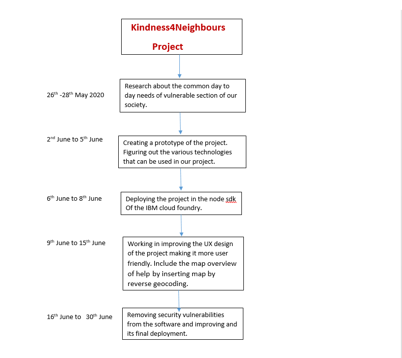

# Long description
In this scenario of covid19 pandemic, there are a lot of people out there, who are either elderly or immunocompromised and they are not willing to risk their health and go outside for necessities like food and other supplies. The goal of this project is to help such people stay safe at home and reduce their risk of infection while ensuring they can still get access to necessities like food and medicines.
    The application we have built helps connect those who want to volunteer to those who need help. These volunteers can help purchase groceries, medicines, or other supplies for someone in need.
    A user can register as a deliverer or a receiver and see a list of corresponding people whom they can help or be helped by. It will connect users to others within their community.
    Our application works on the following workflow:-
  1)Select whether you need help or are willing to offer it.
  2)Search for your location.
  3)Browse the results for posts from nearby neighbors who can help you or require your help.
  4)If you find a suitable result simply reply to the post to get in touch with the author through e-mail.
  5)If there is no suitable result you can create a post to request or offer help for your community to see.
# Solution Roadmap
  
  

# MyCovid19Project

This project was generated with [Angular CLI](https://github.com/angular/angular-cli) version 9.0.3.

## Development server

Run `ng serve` for a dev server. Navigate to `http://localhost:4200/`. The app will automatically reload if you change any of the source files.

## Code scaffolding

Run `ng generate component component-name` to generate a new component. You can also use `ng generate directive|pipe|service|class|guard|interface|enum|module`.

## Build

Run `ng build` to build the project. The build artifacts will be stored in the `dist/` directory. Use the `--prod` flag for a production build.

## Running unit tests

Run `ng test` to execute the unit tests via [Karma](https://karma-runner.github.io).

## Running end-to-end tests

Run `ng e2e` to execute the end-to-end tests via [Protractor](http://www.protractortest.org/).

## Further help

To get more help on the Angular CLI use `ng help` or go check out the [Angular CLI README](https://github.com/angular/angular-cli/blob/master/README.md).
